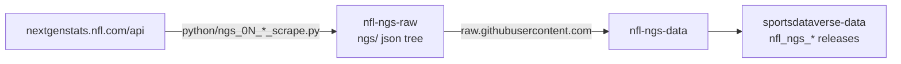

# nfl-ngs-raw

Scrapes the **Next Gen Stats** web API (`nextgenstats.nfl.com/api`) into a
committed raw JSON library. Scraping only — the sibling
[`nfl-ngs-data`](https://github.com/sportsdataverse/nfl-ngs-data) reads this
tree over `raw.githubusercontent.com` (it never clones this repo) and owns
every released `nfl_ngs_*` dataset on
[`sportsdataverse-data`](https://github.com/sportsdataverse/sportsdataverse-data/releases).



## What is captured

| Stage | Route | Committed path | Floor |
|---|---|---|---|
| `ngs_01_schedules_scrape.py` | `league/schedule?season=` | `ngs/schedules/json/{season}.json` + `ngs/schedules/parquet/ngs_schedule_{season}.parquet` + `ngs/ngs_schedule_master.parquet` | 2009 |
| `ngs_02_teams_scrape.py` | `league/teams?season=` | `ngs/teams/json/{season}.json` | 2009 |
| `ngs_03_statboard_scrape.py` | `statboard/{passing,rushing,receiving,leaders}` | `ngs/statboard/{stat}/{season}/{TYPE}_{week}.json` (`week` = int or `all`) | 2016 |
| `ngs_04_leaders_scrape.py` | `leaders/expectation/{completion,ery,yac}/{season,week}`, `leaders/{distance,speed,time}/*` | `ngs/leaders/{family}/{season}/{TYPE}_{week}.json` | 2016 |
| `ngs_05_gamecenter_scrape.py` | `gamecenter/overview?gameId=` | `ngs/gamecenter/{season}/{gameId}.json` | 2012 |

`TYPE` ∈ `PRE|REG|POST`; weeks are the API's absolute numbering (PRE 0–3, REG
1–18, POST 19–23). Seasons are the **starting** calendar year (2025 = 2025-26).
Floors were measured live 2026-09-09 — `statboard/` and `leaders/` answer an
empty list before 2016; empty payloads are never written.

Route surface, auth (there is none — a `Referer` + browser UA is the whole
contract) and the egress-dependent access findings are documented in
`sdv-internal-refs/nfl/nextgenstats/`. The 17 routes this repo does NOT scrape
(`live/*`, the tracking-coordinate payloads, highlight lists) are the ones
denied from every egress tested.

## Run it

```sh
uv sync                                   # once
bash scripts/daily_ngs_scraper.sh         # current season, all 5 stages, commit + push per season
bash scripts/daily_ngs_scraper.sh -s 2016 -e 2025 -r false   # backfill (skips banked, complete weeks)

# one stage, no git
PYTHONPATH=python .venv/bin/python python/ngs_03_statboard_scrape.py -s 2024 -e 2024 -r false
```

Pacing is env-only: `NGS_RAW_SLEEP` (default `0.25`s after every attempt),
`NGS_RAW_TIMEOUT` (`30`), `NGS_RAW_RETRIES` (`4`). Watch a run with
`tail -f logs/nfl_ngs_raw_logfile_<season>.log`.

### Resume semantics (the part worth reading)

Finality is read from the **schedule**, never from a file existing:

- a `(type, week)` is requested only once its first kickoff has passed;
- a week whose games are not all `FINAL` is refetched on every run;
- with `-r false` a week that IS complete, and whose file is valid (parseable,
  non-empty), is trusted — that is what makes a backfill resumable;
- `gamecenter` is fetched only for `FINAL` games and never refetched once banked;
- an empty answer (`stats: []`, an empty body, a 404) is counted, never persisted.

## Automation

The **droplet cron** is the scheduler (daily in season, Aug–Feb). The API's
access is egress-dependent — a GitHub-hosted macOS runner was denied on
2026-09-03 — so `scrape_ngs_raw.yml` is `workflow_dispatch` only, kept as a
tested fallback. Two schedulers producing one tree is how sibling repos have
diverged before; do not add a cron to the workflow.

Every push to `main` fires `nfl_ngs_data_trigger.yml` → `repository_dispatch`
(`daily_nfl_ngs_data`) at `nfl-ngs-data`, forwarding the commit message. The
per-season commit subject `NGS Raw Update (Start: YYYY End: YYYY)` is
**load-bearing**: the data side parses the years out of it.

## Layout

```
python/ngs_raw/            fetch (HTTP contract + env pacing), store (atomic write,
                           validity), schedule (tidy + enumeration), one module per stage
python/ngs_0N_*_scrape.py  numbered thin shims (the directory listing IS the pipeline)
scripts/daily_ngs_scraper.sh   driver: stages in order, commit + push per season
scripts/_venv.sh           interpreter resolution (never `uv run` inside a sweep)
ngs/                       the committed raw tree
logs/                      per-season run logs, committed after each season
tests/                     offline; every fetch injected
```
